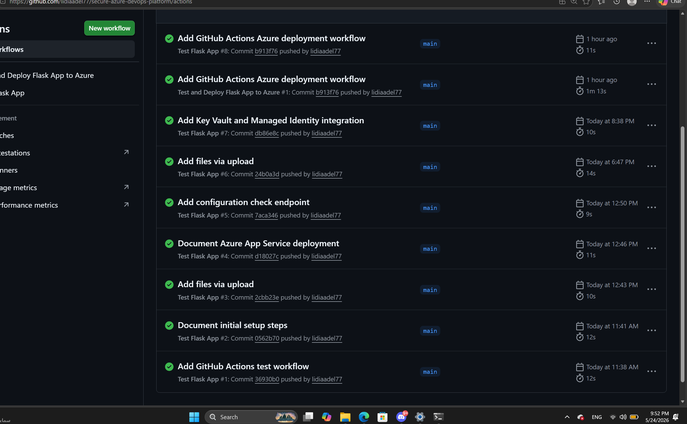
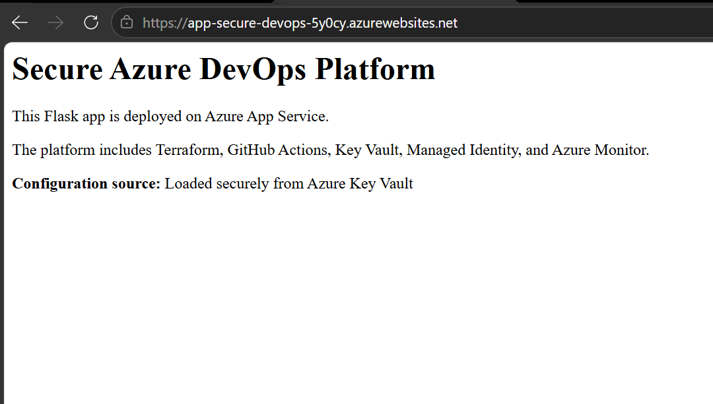
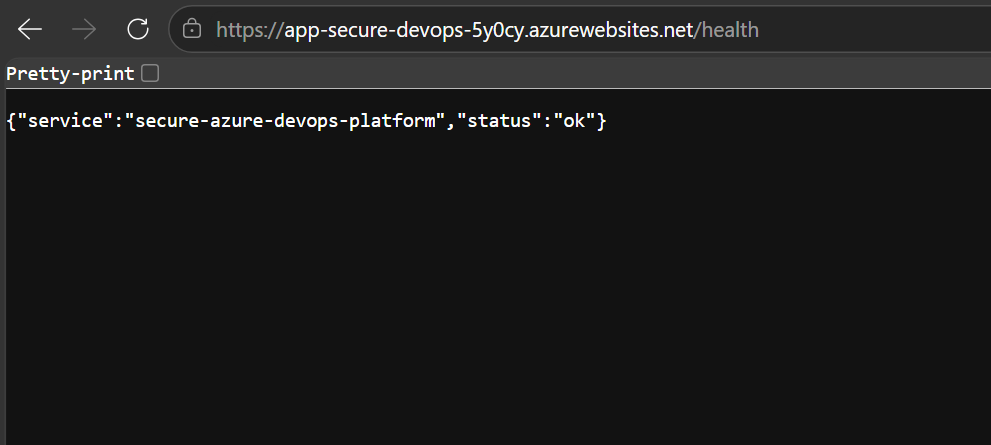
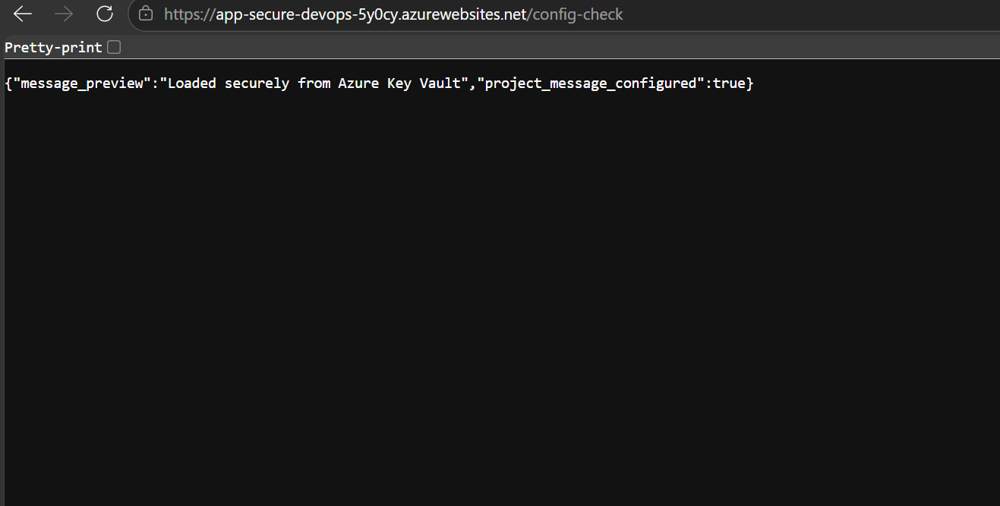
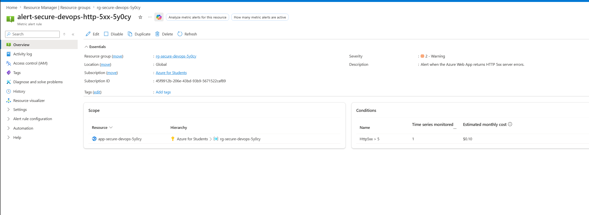
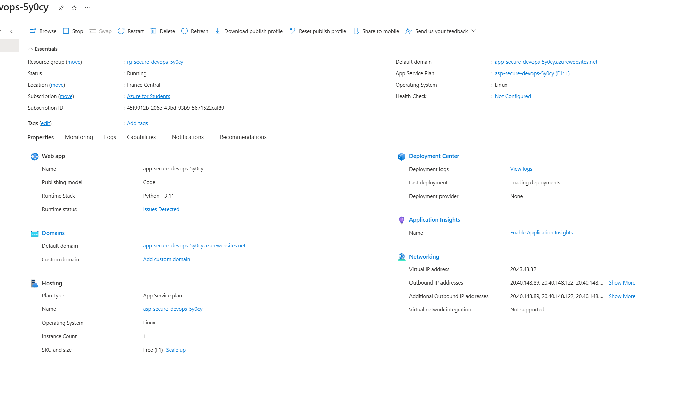
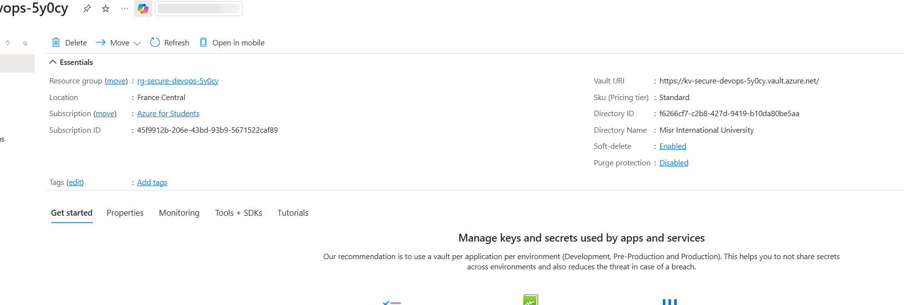
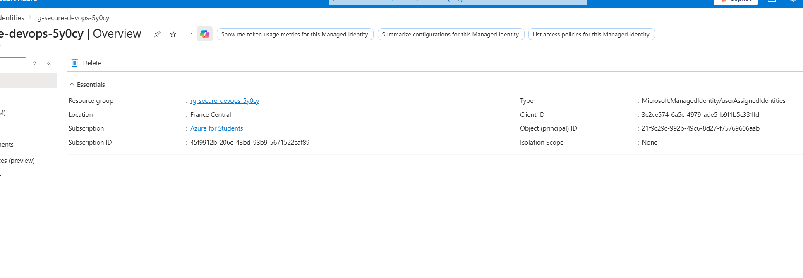

# Secure Azure DevOps Platform

## Overview

This project is a secure Azure cloud engineering and DevOps portfolio project.

It demonstrates how to build, test, deploy, secure, and monitor a Python Flask application on Microsoft Azure using modern cloud practices.

The goal of this project is not only to deploy a web app. The goal is to show a full cloud workflow:

- Application development
- Automated testing
- CI/CD with GitHub Actions
- Infrastructure as Code with Terraform
- Azure App Service deployment
- Secure configuration with Azure Key Vault
- Managed Identity access
- Monitoring and alerting with Azure Monitor

## Live Application

Azure App Service URL:

https://app-secure-devops-5y0cy.azurewebsites.net

Health endpoint:

https://app-secure-devops-5y0cy.azurewebsites.net/health

Configuration check endpoint:

https://app-secure-devops-5y0cy.azurewebsites.net/config-check

## Architecture

The project uses the following architecture:

- GitHub stores the application code and workflow files.
- GitHub Actions runs automated tests and deploys the app.
- Terraform provisions Azure infrastructure.
- Azure App Service hosts the Flask application.
- Azure Key Vault stores secure configuration.
- Managed Identity allows the Web App to read from Key Vault.
- Application Insights and Log Analytics support monitoring.
- Azure Monitor alert detects HTTP 5xx server errors.

## Tools and Services Used

- Python Flask
- Pytest
- GitHub
- GitHub Actions
- Terraform
- Azure App Service
- Azure Key Vault
- User Assigned Managed Identity
- Application Insights
- Log Analytics Workspace
- Azure Monitor Metric Alert
- Azure CLI

## Features Implemented

### Flask Application

The app includes:

- `/` home page
- `/health` health check endpoint
- `/config-check` endpoint to verify Key Vault configuration

### Automated Testing

Pytest is used to test:

- Home page availability
- Health endpoint response

### GitHub Actions CI/CD

The GitHub Actions workflow:

- Checks out the code
- Sets up Python
- Installs dependencies
- Runs tests
- Logs into Azure using OpenID Connect
- Deploys the app to Azure App Service

### Terraform Infrastructure

Terraform provisions:

- Resource Group
- App Service Plan
- Linux Web App
- Key Vault
- Key Vault secret
- User Assigned Managed Identity
- Access policies
- Log Analytics Workspace
- Application Insights
- Azure Monitor Metric Alert

### Secure Configuration

The app reads a configuration value from Azure Key Vault using Managed Identity.

This avoids storing secrets directly inside application code.

### Monitoring and Alerting

Azure Monitor includes an alert for HTTP 5xx server errors.

Alert name:

`alert-secure-devops-http-5xx-5y0cy`

The alert checks the Web App for server-side failures.

## Screenshots

### GitHub Actions Deployment Success

### App Home Page

### Health Endpoint

### Key Vault Config Check

### Azure Monitor Alert

## Project Documentation

Detailed documentation is available inside the `docs` folder:

- `docs/setup-steps.md`
- `docs/deployment-notes.md`
- `docs/security-notes.md`
- `docs/cicd-notes.md`
- `docs/monitoring-notes.md`
- `docs/cost-control.md`
- `docs/troubleshooting.md`

## Key Learning Outcomes

This project demonstrates:

- Cloud deployment using Azure App Service
- Infrastructure as Code using Terraform
- CI/CD automation using GitHub Actions
- Secure secret management using Azure Key Vault
- Identity-based access using Managed Identity
- Application monitoring using Application Insights
- Alerting using Azure Monitor
- Clean technical documentation for cloud projects

## Project Status

Completed initial production-style version.

Future improvements:

- Add Terraform remote state storage
- Add staging and production environments
- Add availability tests
- Add custom domain and HTTPS certificate
- Add more monitoring dashboards

### Azure App Service Overview

### Azure Key Vault Secret

### Managed Identity

